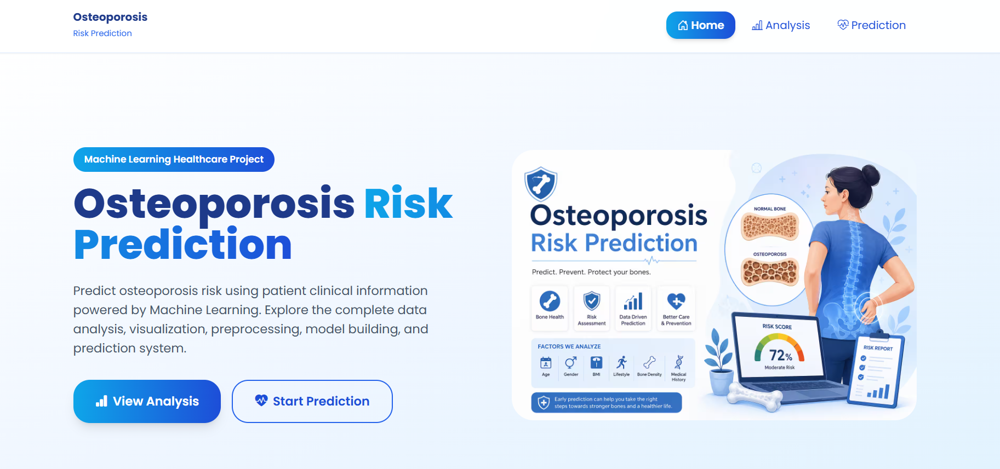

# 🦴 Osteoporosis Risk Prediction

An AI-powered web application that predicts the risk of **Osteoporosis** using Machine Learning. The application helps users assess their osteoporosis risk based on clinical and demographic features, enabling early detection and preventive healthcare.

---

## 📌 Overview

Osteoporosis is a bone disease that weakens bones, making them fragile and more likely to fracture. Early identification of individuals at risk allows timely intervention, reducing the chances of severe bone fractures.

This project utilizes a trained Machine Learning model to classify whether a patient is at risk of osteoporosis based on various health-related parameters.

---

## ✨ Features

- 🦴 Predicts osteoporosis risk instantly
- 🤖 Machine Learning-based prediction
- 📊 User-friendly web interface
- 📱 Responsive design
- ⚡ Fast prediction results
- 🎯 Early risk assessment
- 🔒 Simple and intuitive interface

---

## 📷 Project Screenshot

> Add screenshots inside the `screenshots/` folder.

```
screenshots/
│── home.png
│── prediction.png
│── analysis.png
```

Example:

```markdown

```

---

## 🛠️ Tech Stack

### Frontend

- HTML5
- CSS3
- Tailwind CSS
- JavaScript

### Backend

- Python
- Flask

### Machine Learning

- Scikit-learn
- Pandas
- NumPy
- Joblib

---

## 📂 Project Structure

```
Osteoporosis-Risk-Prediction/
│
├── app.py
├── requirements.txt
├── README.md
├── models/
│   ├── DFC_model.pkl
│   ├── logistic_regression_model.pkl
│   ├── RFC_model.pkl
│   └── SVC_model.pkl
├── api/
│   └── index.py
├── data/
│   ├── osteoporosis_encoded.csv
│   └── osteoporosis.csv
├── static/
│   ├── images/
│   └── js/
│
├── templates/
│   ├── index.html
│   ├── prediction.html
│   ├── analysis.html
│   ├── result.html
│   ├── footer.html
│   ├── navbar.html
│   └── basic.html
│
└── notebook/
    └── Analysis.ipynb
    └── Model_Building.ipynb
```

---

## 📊 Machine Learning Workflow

1. Data Collection
2. Data Cleaning
3. Exploratory Data Analysis (EDA)
4. Feature Engineering
5. Data Preprocessing
6. Feature Scaling
7. Model Training
8. Hyperparameter Tuning
9. Model Evaluation
10. Model Deployment

---

## 🚀 Installation

### Clone the repository

```bash
git clone https://github.com/yourusername/Osteoporosis-Risk-Prediction.git
```

```bash
cd Osteoporosis-Risk-Prediction
```

### Create Virtual Environment

Windows

```bash
python -m venv venv
```

Activate

```bash
venv\Scripts\activate
```

Mac/Linux

```bash
python3 -m venv venv
```

```bash
source venv/bin/activate
```

---

## 📦 Install Dependencies

```bash
pip install -r requirements.txt
```

---

## ▶️ Run the Application

```bash
python app.py
```

Open your browser and visit

```
http://127.0.0.1:5000
```

---

## 📥 Input Features

The model predicts osteoporosis risk using patient information such as:

- Age
- Gender
- BMI
- Physical Activity
- Calcium Intake
- Vitamin D Level
- Smoking Status
- Alcohol Consumption
- Family History
- Previous Fracture History
- Medical Conditions
- Other clinical features (depending on the dataset)

---

## 📤 Output

The model predicts one of the following:

- ✅ Low Risk
- ⚠️ High Risk

Along with prediction confidence (if implemented).

---

## 📈 Model Performance

The following table shows the training accuracy achieved by each Machine Learning algorithm used in this project.

| Machine Learning Model          | Training Accuracy |
| ------------------------------- | ----------------: |
| Logistic Regression             |        **82.85%** |
| Random Forest Classifier        |        **93.94%** |
| Decision Tree Classifier        |        **90.95%** |
| Support Vector Classifier (SVC) |        **83.43%** |

### 🏆 Best Performing Model

 The **Random Forest Classifier** achieved the highest training accuracy of **93.94%**, making it the selected model for osteoporosis risk prediction in this project.

## 📚 Python Libraries

```
Flask
Pandas
NumPy
Scikit-learn
Joblib
Matplotlib
Seaborn
```

---

## 💡 Future Improvements

- Deep Learning model
- Explainable AI (SHAP/LIME)
- Patient history tracking
- PDF report generation
- Cloud deployment
- REST API integration
- Mobile application

---

## 🤝 Contributing

Contributions are welcome!

1. Fork the repository
2. Create a new feature branch

```bash
git checkout -b feature-name
```

3. Commit your changes

```bash
git commit -m "Added new feature"
```

4. Push to GitHub

```bash
git push origin feature-name
```

5. Create a Pull Request

---

## 👨‍💻 Author

**Karmegam J**

Senior AR Analyst | Aspiring Data Scientist

- Python
- Machine Learning
- Data Analytics
- Flask
- SQL
- Power BI

---

## ⭐ Support

If you found this project helpful, please give it a ⭐ on GitHub.

It helps others discover the project and motivates further improvements.

---

### 🩺 Early Detection • Better Clinical Decision Support • Reduced Fracture Risk • Preventive Healthcare
